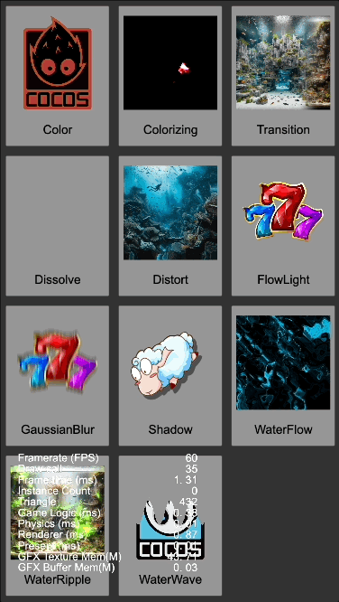

# CC3.SpriteEffect.DemoProject

   

關於 [CC3.SpriteEffect](https://github.com/BricL/CC3.SpriteEffect) 的效果範例，都在這個項目專案中。

## 注意事項
* CC3.SpriteEffect 為此專案的 Submodule
* 請記得一起下載 CC3.SpriteEffect 並安裝至:
  
  >[project_folder]/extensions/sprite_effect 下
* 若用 git clone，記得啟動 submodule 並 clone CC3.SpriteEffect

## itch.io Demo

