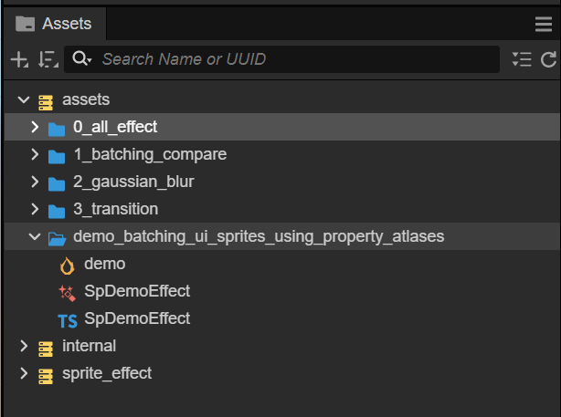

# CC3.SpriteEffect.DemoProject

 

  

語言(Language) CN | [EN](./README(e).md)

此項目為 [CC3.SpriteEffect](https://github.com/BricL/CC3.SpriteEffect) 中每個 Effect 的 Demo。

## 注意事項
* CC3.SpriteEffect 為此專案的 Submodule
* 請記得一起下載 CC3.SpriteEffect 並安裝至`${PROJECT_FOLDER}/extensions/sprite_effect`，或啟動 submodule 並 clone CC3.SpriteEffect

## itch.io Demo (https://bricl.itch.io/cc3spriteeffectdemo)

<p align="center"></p>


# UI(Sprite) 利用 Property Atlas 合批

依官方文件[【2D 渲染组件合批规则说明】](https://docs.cocos.com/creator/3.8/manual/zh/ui-system/components/engine/ui-batch.html#%E5%90%88%E6%89%B9%E6%96%B9%E6%B3%95%E8%AF%B4%E6%98%8E)，Sprite 一但使用 customMaterial 合批 (batch) 就會被拆分。而同 Shader 不同參數想合批，正統是將參數帶入頂點中。詳細做法論壇上的 bakabird 大大提供保母級的教程 [【分享】CocosCreator3.x 应用在UI(Sprite) 上的 shader(.effect) 的合批，通过自定义顶点参数](https://forum.cocos.org/t/topic/153963)。

這方法需對 Sprite 的 4 種頂點宣告模式 (SIMPLE、SLICE、TILED、FILLED) 作實現。那...還有其他方法可以不用動到修改頂點格式嗎？

## 目錄

* [Propert Atlas](#propert-atlas)
* [上代碼](#上代碼)
* [範例專案下載](#範例專案下載)
* [參考文獻](#參考文獻)


## Propert Atlas

這方法的特點在於，不同 Sprite 相同 Shader 效果下，將自己所屬的設定參數 pack 至貼圖中，渲染時透過索引於取出所屬參數進行計算，如此就能利用引擎本身的合批規則減少 Drawcall。

### 實踐思路

* 對一 Shader 效果準備一張格式 RGBA32 的 `參數貼圖(PropsTexture)`。

* 每個 Sprite 在同一 Shader 效果下，自有所屬唯一的 index。

* 藉此 index 在渲染時對 `參數貼圖(PropsTexture)` 取出所屬參數並計算。

* 屬性貼圖的儲存方式

    <p align="center"></p>

    因此屬性貼圖`propsTexture`的 width 取決於一次能合批(batch)多少個 sprite，若為 64 代表最多可以一次合批(batch) 64 個獨立的 sprite，可依使用場景調整。

## 上代碼

### SpDemoEffect.ts

* 繼承 Sprite Component

    ```typescript
    @ccclass('SpDemoEffect')
    export class SpDemoEffect extends Sprite { 
        //...略
    }
    ```

* static 參數

    ```typescript
    @ccclass('SpDemoEffect')
    export class SpDemoEffect extends Sprite { 
        private static propsTexture: Texture2D | null = null;
        private static propBuffer: Float32Array | null = null;
        private static effectUUID: string[] = [];
        private static mat: Material | null = null;
        private static isDirty: boolean = false;
        private instanceID: number = -1;
        //...略
    }
    ```

    在同一 Sprite Shader 效果下，所有 Sprite 共用的參數: 

    * `propsTexture`，參數貼圖，用來儲存同一個 Shader 效果不同 Sprite 各自的設定參數。

    * `propBuffer`，TypeScript 端參數 buffer，暫存參數並於 `laterUpdate()` 檢查異動同步 `propsTexture`。

    * `effectUUID` 與 `instanceID`，利用 CC 每個 Node 的 uuid 唯一性，給予當下 Sprite 一個唯一的 `instanceID`。

        ```typescript
        this.instanceID = SpDemoEffect.effectUUID.findIndex((uuid) => uuid === this.node.uuid);
        
        if (this.instanceID === -1) {
            this.instanceID = SpDemoEffect.effectUUID.push(this.node.uuid) - 1;
        }
        ```

    * `mat`，同 Sahder 效果共用一個材質。

    * `isDirty`，參數異動的旗標。

* 建立參數貼圖

    ```typescript
    const PROP_TEXTURE_SIZE = 128; // 定義屬性貼圖 width

    @ccclass('SpDemoEffect')
    export class SpDemoEffect extends Sprite { 
        //...略
        start() {
            if (!this.effectAsset) {
                warn("需指定 effect asset");
                return;
            }

            // 利用 CC 每個 Node 的 uuid 唯一性，給予當下 Sprite 一個唯一的 `instanceID`
            this.instanceID = SpDemoEffect.effectUUID.findIndex((uuid) => uuid === this.node.uuid);
            if (this.instanceID === -1) {
                this.instanceID = SpDemoEffect.effectUUID.push(this.node.uuid) - 1;
            }

            // 利用 Sprite Component 中的 color 將 instanceID 傳入 Shader 效果中
            this.color = new Color(this.instanceID % PROP_TEXTURE_SIZE,
                this.pixelsUsage,
                PROP_TEXTURE_SIZE,
                255);

            if (SpDemoEffect.mat === null) {
                // 建立材質與屬性貼圖(PropsTexture)
                const w = PROP_TEXTURE_SIZE;
                const h = this.pixelsUsage;

                SpDemoEffect.propBuffer = new Float32Array(w * h * 4);
                for (let y = 0; y < h; y++) {
                    for (let x = 0; x < w; x++) {
                        const index = (x + (y * w)) * 4;
                        SpDemoEffect.propBuffer[index] = 1;
                        SpDemoEffect.propBuffer[index + 1] = 0;
                        SpDemoEffect.propBuffer[index + 2] = 1;
                        SpDemoEffect.propBuffer[index + 3] = 1;
                    }
                }

                SpDemoEffect.propsTexture = new Texture2D();
                SpDemoEffect.propsTexture.setFilters(Texture2D.Filter.NEAREST, Texture2D.Filter.NEAREST);
                SpDemoEffect.propsTexture.reset({
                    width: w,
                    height: h,
                    format: Texture2D.PixelFormat.RGBA32F,
                    mipmapLevel: 0
                });
                SpDemoEffect.propsTexture.uploadData(SpDemoEffect.propBuffer);
                //...略
            }
            //...略
        }
        //...略
    }
    ```

* 建立客制材質，綁定 `propsTexture` 指定至 customMaterial 參數

    ```typescript
    const PROP_TEXTURE_SIZE = 128;

    @ccclass('SpDemoEffect')
    export class SpDemoEffect extends Sprite { 
        //...略
        start() {
            //...略
            // 建立客制材質，綁定 `propsTexture` 指定至 customMaterial 參數
            if (SpDemoEffect.mat === null) {
                //...略
                SpDemoEffect.mat = new Material();
                SpDemoEffect.mat.initialize(
                    {
                        effectAsset: this.effectAsset,
                        defines: {},
                        technique: 0
                    }
                );
                SpDemoEffect.mat.setProperty('propsTexture', SpDemoEffect.propsTexture);
            }

            this.customMaterial = SpDemoEffect.mat;
            this.reflashParams();
        }
        //...略
    }
    ```

* `laterUpdate`，若有參數有異動時進行更新

  ```typescript
  @ccclass('SpDemoEffect')
  export class SpDemoEffect extends Sprite {
    //...略
    start() {
        //...略
    }

    lateUpdate(deltaTime: number) {
        if (SpDemoEffect.isDirty) {
            SpDemoEffect.propsTexture!.uploadData(SpDemoEffect.propBuffer!);
            SpDemoEffect.isDirty = false;
        }
    }
  }
  ```

* 每個 Sprite 的 `instanceID` 利用 Sprite.color 傳入 Shader 效果中，在 TypeScript 中編碼

    ```typescript
    this.color = new Color(this.instanceID,
                           this.pixelsUsage,
                           PROP_TEXTURE_SIZE,
                           255);
    ```

    * R通道 `this._instanceID`

    * G通道 `pixelsUsage`，一個 pixel 有 4 個 float 可以保存參數，代表這個 Shader 效果參數用了幾個 4 各 float。

    * B通道 `PROP_TEXTURE_SIZE`，參數貼圖 Width。

    * A通道 `255`，設定為預設值不使用。

### SpDemoEffect.effect

這個 Shader 效果為簡單定義一個 `effectColor` 對原 Sprite 進行顏色相加。

* 代碼如下

    ```GLSL
    CCEffect %{
        techniques:
        - name: default
            passes:
            - vert: sprite-vs:vert
            frag: sprite-fs:frag
            depthStencilState:
                depthTest: false
                depthWrite: false
            blendState:
                targets:
                - blend: true
                blendSrc: src_alpha
                blendDst: one_minus_src_alpha
                blendDstAlpha: one_minus_src_alpha
            rasterizerState:
                cullMode: none
            properties: &props
                alphaThreshold: { value: 0.5 }
                propsTexture: { value: white, editor: { type: sampler2D }}
    }%

    CCProgram sprite-vs %{
        precision highp float;
        #include <cc-global>
        #if USE_LOCAL
            #include <cc-local>
        #endif
        #if SAMPLE_FROM_RT
            #include <common/common-define>
        #endif
        
        in vec3 a_position;
        in vec2 a_texCoord;
        in vec4 a_color;

        out vec4 color;
        out vec2 uv0;

        vec4 vert () {
            //...略
        }
    }%

    CCProgram sprite-fs %{
        precision highp float;
        #include <embedded-alpha>
        #include <alpha-test>
        #include <sprite-texture>
        #include "./chunks/util.chunk"

        in vec4 color; // 原 Sprite 屬性 color，用來當做 index 參數。
        in vec2 uv0;

        uniform sampler2D propsTexture;

        vec4 frag () {
            // [記住] Sprite 原始的 color 屬性已經被拿去當作 index。
            vec4 effectColor = getPropFromPropTexture(propsTexture, color, 0);

            // [小心思] index 編碼避免使用 a，因此會保留為 CC 中上一階 Canvas
            // 透明 a，讓自定義的效果依然能正常受影響。
            effectColor = vec4(effectColor.rgb, effectColor.a * color.a); 

            vec4 o = vec4(1, 1, 1, 1);
            o = CCSampleWithAlphaSeparated(cc_spriteTexture, uv0);

            // 顏色與 effectColor 相加
            o = vec4(o.rgb + effectColor.rgb, o.a * effectColor.a);

            ALPHA_TEST(o);
            return o;
        }
    }%
    ```

* 在 Shader 中解碼 Sprite.color

    ```GLSL
    // propTexture: 參數贴图
    // encodeIdx: 參數索引編碼
    // idxOfProps: 效果中的參數索引
    vec4 getPropFromPropTexture(sampler2D propsTexture, vec4 encodeIdx, int idxOfProps) {
        vec2 prop_uv = vec2((1.0/(encodeIdx.b * 255.0)) * (encodeIdx.r * 255.0), 
                            (1.0/(encodeIdx.g * 255.0)) * float(idxOfProps));
        return texture(propsTexture, prop_uv);
    }
    ```

    * `propsTexture`，屬性貼圖。

    * `encodeColor`，傳入的 Sprite.color，解碼後即為 `instanceID` ，貼圖座標的 `u` 用來存取 `propsTexture`。

    * `idxOfProps`，解法後為 Shader 效果中的第幾個參數，貼圖座標的 `v` 用來存取 `propsTexture`。

## 範例專案下載

* 範例完整代碼在 [GitHub CC3.SpriteEffect.DemoProject](https://github.com/BricL/CC3.SpriteEffect.DemoProject) 。

* 上述概念在 [GitHub CC3.SpriteEffect](https://github.com/BricL/CC3.SpriteEffect/tree/master) 實現了一個樣板庫，可依此延伸出各種 Sprite 效果合批方。

<p align="center"></p>
<p align="center"></p>

## 參考文獻
* [【分享】CocosCreator3.x 应用在UI(Sprite) 上的 shader(.effect) 的合批，通过自定义顶点参数](https://forum.cocos.org/t/topic/153963)

* [2D 渲染组件合批规则说明](https://docs.cocos.com/creator/3.8/manual/zh/ui-system/components/engine/ui-batch.html#%E5%90%88%E6%89%B9%E6%96%B9%E6%B3%95%E8%AF%B4%E6%98%8E)


